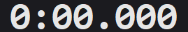

# Speedrun-Timer

Ein schlanker Speedrun-Timer für Windows – ähnlich wie LiveSplit, aber
bewusst auf das Wesentliche reduziert: eine große Zeitanzeige, vier Knöpfe
und globale Hotkeys, die auch dann funktionieren, wenn ein Spiel im
Vordergrund läuft.


## Funktionen

- Vier Zustände: **Bereit**, **Läuft**, **Pausiert**, **Gestoppt**
- Jede Aktion per Knopf **oder** per globalem Hotkey auslösbar
- Pausen und Stopps zählen nicht zur Laufzeit
- Nach einem Stop lässt sich der Lauf fortsetzen, statt neu zu beginnen
- Frei belegbare Hotkeys mit Erkennung von Doppelbelegungen
- Anzeige im Format `M:SS.mmm`, ab einer Stunde `H:MM:SS.mmm`
- Kompaktmodus: nur die Zeit, ohne Titelleiste – als Overlay neben dem Spiel
- Frei skalierbar: die Zeitanzeige wächst mit dem Fenster
- Zeit von Hand setzbar
- Zeiten unter einem Namen speichern und beim nächsten Start fortsetzen –
  der geladene Stand bleibt geöffnet und wird weiterbearbeitet wie eine Datei
- Suche über Name und Datum in einem Feld, ohne Filterauswahl
- Fenster wahlweise immer im Vordergrund, dunkles Farbschema

Nicht enthalten: Splits, Bestzeiten-Vergleiche, Netzwerkfunktionen.

## Installation

Vorausgesetzt wird Python 3.12 oder neuer unter Windows.

```powershell
git clone https://github.com/thebestjonkai/Speedrun-Timer.git
cd Speedrun-Timer
pip install -r requirements.txt
```

Die einzige Abhängigkeit ist [pynput](https://pypi.org/project/pynput/) für
die globalen Hotkeys. Die Oberfläche nutzt tkinter, das bei Windows-Python
bereits mitgeliefert wird.

## Starten

```powershell
python main.py
```

### Verknüpfung auf dem Desktop

Für den Start per Doppelklick lässt sich eine Verknüpfung anlegen. Wichtig
ist dabei `pythonw.exe` statt `python.exe` – sonst steht neben dem Timer
dauerhaft ein schwarzes Konsolenfenster offen.

```powershell
$projekt = (Get-Location).Path
$shell = New-Object -ComObject WScript.Shell
$v = $shell.CreateShortcut((Join-Path ([Environment]::GetFolderPath("Desktop")) "Speedrun-Timer.lnk"))
$v.TargetPath = (Get-Command pythonw.exe).Source
$v.Arguments = '"' + (Join-Path $projekt "main.py") + '"'
$v.WorkingDirectory = $projekt
$v.IconLocation = (Join-Path $projekt "timer_icon.ico") + ",0"
$v.Save()
```

Die Verknüpfung merkt sich feste Pfade: Wird der Projektordner verschoben
oder Python auf eine neue Hauptversion aktualisiert, muss sie neu erstellt
werden.

## Bedienung

| Aktion | Standard-Hotkey | Wirkung |
|---|---|---|
| Start  | `F12` + `S` | Startet bei 0 – oder setzt einen gestoppten Lauf fort |
| Pause  | `F12` + `P` | Hält die Zeit an, erneut gedrückt läuft sie weiter |
| Stop   | `F12` + `X` | Friert die Zeit ein |
| Reset  | `F12` + `R` | Setzt die Anzeige auf 0 zurück |
| Kompakt | `F12` + `K` | Schaltet zwischen normaler Ansicht und reiner Zeitanzeige um |

Halte `F12` gedrückt und tippe die zweite Taste an. Die Reihenfolge spielt
keine Rolle, und `F12` allein löst nichts aus.

Knöpfe, die im aktuellen Zustand nichts bewirken würden, sind ausgegraut.
Die Farbe der Zeitanzeige zeigt den Zustand auch ohne Lesen an: weiß für
bereit, grün für laufend, gelb für pausiert, blau für gestoppt.

Pausen zählen nicht mit. Wer nach 10 Sekunden pausiert, eine Minute wartet
und dann fortsetzt, steht weiterhin bei 10 Sekunden. Für Stopps gilt
dasselbe – ein Stop friert die Zeit nur ein. Einen frischen Lauf beginnst du
mit Reset und dann Start.

## Zeit von Hand setzen

Der Knopf **Zeit** öffnet ein Feld, in das sich die Zeit direkt eintragen
lässt – praktisch, wenn der Start verpasst wurde oder ein Lauf ab einer
Zwischenzeit geübt werden soll. Im Kompaktmodus geht das über das
Rechtsklick-Menü.

Erlaubt sind mehrere Schreibweisen, Komma und Punkt gelten beide als
Dezimaltrenner:

| Eingabe | Bedeutung |
|---|---|
| `12` | 12 Sekunden |
| `1:23` | 1 Minute 23 Sekunden |
| `1:23,456` | mit Millisekunden |
| `2:03:04.5` | 2 Stunden 3 Minuten 4,5 Sekunden |

Der Zustand bleibt dabei erhalten: Ein laufender Timer läuft ab dem neuen
Wert weiter, ein pausierter bleibt stehen. Nur aus *Bereit* wird *Gestoppt* –
„bereit“ heißt ja, dass die Uhr auf null steht.

## Zeiten speichern und fortsetzen

Ein längerer Lauf muss nicht in einer Sitzung fertig werden. Gespeicherte
Stände verhalten sich wie Dateien in einer Textverarbeitung: Man legt einen
an, lädt ihn später wieder und arbeitet daran weiter.

**Speichern unter …** fragt nach einem Namen und legt die aktuelle Zeit
darunter ab – zum Beispiel „Any% Übung“ oder „Bosskampf“. Damit ist dieser
Stand *geöffnet*; sein Name steht ab jetzt in der Titelleiste.

**Speichern** schreibt ohne weitere Rückfrage in den geöffneten Stand –
dasselbe wie `Strg`+`S` in Word. Ist keiner geöffnet, fragt das Programm
einmalig nach einem Namen.

Beim nächsten Start erscheint die Liste der gespeicherten Stände von selbst,
sobald mindestens einer vorhanden ist. Ein Doppelklick auf einen Eintrag
übernimmt ihn, **Neu beginnen** überspringt die Abfrage. Mitten in einer
Sitzung führt der Knopf **Laden** zur selben Liste. Das Zeichen ▸ markiert
darin den gerade geöffneten Stand.

Nach dem Laden steht der Timer auf der gespeicherten Zeit und ist *gestoppt*:
Der Startknopf heißt dann **Weiter** und setzt den Lauf ab dieser Zeit fort.
Läuft gerade ein Lauf, fragt der Timer vorher nach – dessen Zeit wäre sonst
verloren.

Ein Stand bleibt geöffnet, bis ein anderer geladen oder unter einem neuen
Namen gespeichert wird – auch über **Reset** hinweg, genau wie ein Dokument
beim Löschen seines Inhalts geöffnet bleibt. Nach einem Reset schreibt
**Speichern** also `0:00.000` in den geöffneten Stand. Die Titelleiste zeigt
jederzeit, worauf sich das Speichern bezieht.

### Suchen

Über der Liste liegt ein Suchfeld. Es durchsucht **Name und Datum
gleichzeitig**, ohne dass vorher ein Filter gewählt werden muss:

| Eingabe | Findet |
|---|---|
| `boss` | alle Stände, deren Name „boss“ enthält |
| `19.09` oder `19.9` | alles vom 19. September – die führende Null ist egal |
| `09.2026` | den ganzen Monat |
| `any 20.09` | „Any%…“ **und** vom 20.09. – mehrere Wörter grenzen weiter ein |

Gefiltert wird bei jedem Tastendruck; ein Bestätigen entfällt. `Eingabe` lädt
den obersten Treffer, `Pfeil runter` springt in die Liste.

Ein Name, der schon vergeben ist, überschreibt den alten Eintrag; das
Speichern-Fenster weist vorher darauf hin. **Löschen** entfernt den
markierten Eintrag nach einer Rückfrage.

Gespeichert wird in `timer_staende.json` neben dem Skript. Fehlt die Datei
oder ist sie beschädigt, startet das Programm ohne gespeicherte Stände,
statt abzustürzen.

## Fenstergröße

Das Fenster lässt sich in beiden Ansichten frei skalieren – die Zeitanzeige
wächst und schrumpft mit. In der normalen Ansicht geht das wie gewohnt am
Fensterrand, zusätzlich in beiden Ansichten mit dem **Mausrad**. Im
Kompaktmodus ist das Mausrad der einzige Weg, weil dort der Fensterrand
fehlt.

Nach unten begrenzt die Größe der Bedienelemente, wie klein es werden kann;
im Kompaktmodus geht es deutlich weiter herunter.

## Kompaktmodus



Der Knopf **Kompakt** (oder `F12`+`K`) reduziert das Fenster auf die reine
Zeitanzeige und blendet dabei auch die Titelleiste aus – praktisch als
Overlay neben dem Spiel.

Weil in dieser Ansicht die Titelleiste fehlt, übernehmen Maus und
Kontextmenü deren Aufgaben:

- **Ziehen** mit der linken Maustaste verschiebt das Fenster
- **Doppelklick** kehrt zur normalen Ansicht zurück
- **Rechtsklick** öffnet ein Menü mit *Normale Ansicht*, *Zeit eingeben*,
  *Stand speichern*, *Speichern unter*, *Stand laden* und *Beenden*

- **Mausrad** vergrößert und verkleinert das Fenster

Im Kompaktmodus hält sich das Fenster immer im Vordergrund, unabhängig von
der Checkbox. Ohne Titelleiste erscheint es nämlich nicht in der Taskleiste –
es würde sonst hinter dem Spiel verschwinden und wäre nicht mehr erreichbar.
Beim Zurückschalten gilt wieder, was die Checkbox sagt.

## Hotkeys ändern


Über den Knopf **Einstellungen** rechts unten. Dort gibt es je Aktion eine
Zeile mit der aktuellen Belegung und einem Knopf „Neu belegen“: einmal
klicken, gewünschte Tastenkombination drücken und wieder loslassen – fertig.
`Esc` bricht ab, ein zweiter Klick auf denselben Knopf ebenfalls. Ist eine
Kombination bereits vergeben, erscheint eine Fehlermeldung und die alte
Belegung bleibt bestehen. „Standard“ stellt die Ausgangsbelegung wieder her.

Änderungen gelten sofort und werden in `timer_config.json` neben dem Skript
gespeichert. Fehlt die Datei oder ist sie beschädigt, startet das Programm
mit der Standardbelegung, statt abzustürzen.

## Gut zu wissen

**F12 ist bei Steam die Screenshot-Taste.** Da der Timer Tasten zwar
abfängt, aber nicht blockiert, macht Steam bei jedem `F12`+`S` zusätzlich
einen Screenshot. Entweder in Steam unter *Einstellungen → Im Spiel* die
Screenshot-Taste ändern, oder im Timer eine andere Kombination wählen. Der
Nummernblock eignet sich gut, weil Spiele ihn selten belegen.

**Reagieren die Hotkeys in einem bestimmten Spiel nicht**, starte den Timer
als Administrator. Windows liefert einem normal laufenden Programm keine
Tastendrücke aus einem Fenster, das mit erhöhten Rechten läuft.

**Tastendrücke erreichen weiterhin das Spiel.** Belegt das Spiel dieselben
Tasten, passiert beides gleichzeitig.

## Projektaufbau

| Datei | Inhalt |
|---|---|
| `timer_logik.py` | Zustände und Zeitmessung, komplett ohne Oberfläche |
| `hotkeys.py` | Globale Tasten, Aufnahme neuer Belegungen, Konfigurationsdatei |
| `einstellungen.py` | Das Einstellungsfenster |
| `zeit_eingabe.py` | Das Fenster zum Setzen der Zeit von Hand |
| `staende.py` | Gespeicherte Zeiten und ihre Datei, ohne Oberfläche |
| `staende_fenster.py` | Die Fenster zum Speichern und Auswählen |
| `stil.py` | Farben und Schriften |
| `main.py` | Hauptfenster |
| `test_timer_logik.py` | Tests der Timer-Logik |
| `test_staende.py` | Tests der Speicherfunktion |
| `test_anzeige.py` | Tests der Zeitanzeige, mit echtem Fenster |

Die Zeitmessung stützt sich auf `time.perf_counter()` und zählt nichts hoch,
sondern berechnet die Anzeige bei jeder Aktualisierung neu. Dadurch kann die
Zeit weder driften noch springen, wenn Windows die Systemuhr abgleicht.

## Tests

```powershell
python test_timer_logik.py
python test_staende.py
python test_anzeige.py
```

Timer-Logik und Speicherfunktion werden ohne Oberfläche geprüft.
`test_anzeige.py` baut dagegen echte Fenster auf und misst nach, dass die
Zeit hineinpasst – auch bei Werten über einer Stunde, die drei Zeichen
länger sind. Dass dabei kurz Fenster aufblitzen, ist normal.

Alle Tests kommen ohne Zusatzpakete aus.
