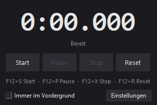
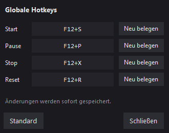

# Speedrun-Timer

Ein schlanker Speedrun-Timer für Windows – ähnlich wie LiveSplit, aber
bewusst auf das Wesentliche reduziert: eine große Zeitanzeige, vier Knöpfe
und globale Hotkeys, die auch dann funktionieren, wenn ein Spiel im
Vordergrund läuft.



## Funktionen

- Vier Zustände: **Bereit**, **Läuft**, **Pausiert**, **Gestoppt**
- Jede Aktion per Knopf **oder** per globalem Hotkey auslösbar
- Pausen und Stopps zählen nicht zur Laufzeit
- Nach einem Stop lässt sich der Lauf fortsetzen, statt neu zu beginnen
- Frei belegbare Hotkeys mit Erkennung von Doppelbelegungen
- Anzeige im Format `M:SS.mmm`, ab einer Stunde `H:MM:SS.mmm`
- Fenster wahlweise immer im Vordergrund, dunkles Farbschema

Nicht enthalten: Splits, Bestzeiten-Vergleiche, Netzwerkfunktionen.

## Installation

Vorausgesetzt wird Python 3.12 oder neuer unter Windows.

```powershell
git clone https://github.com/thebestjonkai/Speedrun-Timer.git
cd Speedrun-Timer
pip install -r requirements.txt
```

Die einzige Abhängigkeit ist [pynput](https://pypi.org/project/pynput/) für
die globalen Hotkeys. Die Oberfläche nutzt tkinter, das bei Windows-Python
bereits mitgeliefert wird.

## Starten

```powershell
python main.py
```

### Verknüpfung auf dem Desktop

Für den Start per Doppelklick lässt sich eine Verknüpfung anlegen. Wichtig
ist dabei `pythonw.exe` statt `python.exe` – sonst steht neben dem Timer
dauerhaft ein schwarzes Konsolenfenster offen.

```powershell
$projekt = (Get-Location).Path
$shell = New-Object -ComObject WScript.Shell
$v = $shell.CreateShortcut((Join-Path ([Environment]::GetFolderPath("Desktop")) "Speedrun-Timer.lnk"))
$v.TargetPath = (Get-Command pythonw.exe).Source
$v.Arguments = '"' + (Join-Path $projekt "main.py") + '"'
$v.WorkingDirectory = $projekt
$v.IconLocation = (Join-Path $projekt "timer_icon.ico") + ",0"
$v.Save()
```

Die Verknüpfung merkt sich feste Pfade: Wird der Projektordner verschoben
oder Python auf eine neue Hauptversion aktualisiert, muss sie neu erstellt
werden.

## Bedienung

| Aktion | Standard-Hotkey | Wirkung |
|---|---|---|
| Start  | `F12` + `S` | Startet bei 0 – oder setzt einen gestoppten Lauf fort |
| Pause  | `F12` + `P` | Hält die Zeit an, erneut gedrückt läuft sie weiter |
| Stop   | `F12` + `X` | Friert die Zeit ein |
| Reset  | `F12` + `R` | Setzt die Anzeige auf 0 zurück |

Halte `F12` gedrückt und tippe die zweite Taste an. Die Reihenfolge spielt
keine Rolle, und `F12` allein löst nichts aus.

Knöpfe, die im aktuellen Zustand nichts bewirken würden, sind ausgegraut.
Die Farbe der Zeitanzeige zeigt den Zustand auch ohne Lesen an: weiß für
bereit, grün für laufend, gelb für pausiert, blau für gestoppt.

Pausen zählen nicht mit. Wer nach 10 Sekunden pausiert, eine Minute wartet
und dann fortsetzt, steht weiterhin bei 10 Sekunden. Für Stopps gilt
dasselbe – ein Stop friert die Zeit nur ein. Einen frischen Lauf beginnst du
mit Reset und dann Start.

## Hotkeys ändern



Über den Knopf **Einstellungen** rechts unten. Dort gibt es je Aktion eine
Zeile mit der aktuellen Belegung und einem Knopf „Neu belegen“: einmal
klicken, gewünschte Tastenkombination drücken und wieder loslassen – fertig.
`Esc` bricht ab, ein zweiter Klick auf denselben Knopf ebenfalls. Ist eine
Kombination bereits vergeben, erscheint eine Fehlermeldung und die alte
Belegung bleibt bestehen. „Standard“ stellt die Ausgangsbelegung wieder her.

Änderungen gelten sofort und werden in `timer_config.json` neben dem Skript
gespeichert. Fehlt die Datei oder ist sie beschädigt, startet das Programm
mit der Standardbelegung, statt abzustürzen.

## Gut zu wissen

**F12 ist bei Steam die Screenshot-Taste.** Da der Timer Tasten zwar
abfängt, aber nicht blockiert, macht Steam bei jedem `F12`+`S` zusätzlich
einen Screenshot. Entweder in Steam unter *Einstellungen → Im Spiel* die
Screenshot-Taste ändern, oder im Timer eine andere Kombination wählen. Der
Nummernblock eignet sich gut, weil Spiele ihn selten belegen.

**Reagieren die Hotkeys in einem bestimmten Spiel nicht**, starte den Timer
als Administrator. Windows liefert einem normal laufenden Programm keine
Tastendrücke aus einem Fenster, das mit erhöhten Rechten läuft.

**Tastendrücke erreichen weiterhin das Spiel.** Belegt das Spiel dieselben
Tasten, passiert beides gleichzeitig.

## Projektaufbau

| Datei | Inhalt |
|---|---|
| `timer_logik.py` | Zustände und Zeitmessung, komplett ohne Oberfläche |
| `hotkeys.py` | Globale Tasten, Aufnahme neuer Belegungen, Konfigurationsdatei |
| `einstellungen.py` | Das Einstellungsfenster |
| `stil.py` | Farben und Schriften |
| `main.py` | Hauptfenster |
| `test_timer_logik.py` | Tests der Timer-Logik |

Die Zeitmessung stützt sich auf `time.perf_counter()` und zählt nichts hoch,
sondern berechnet die Anzeige bei jeder Aktualisierung neu. Dadurch kann die
Zeit weder driften noch springen, wenn Windows die Systemuhr abgleicht.

## Tests

```powershell
python test_timer_logik.py
```

Die Tests prüfen die Timer-Logik ohne Oberfläche und kommen ohne
Zusatzpakete aus.
